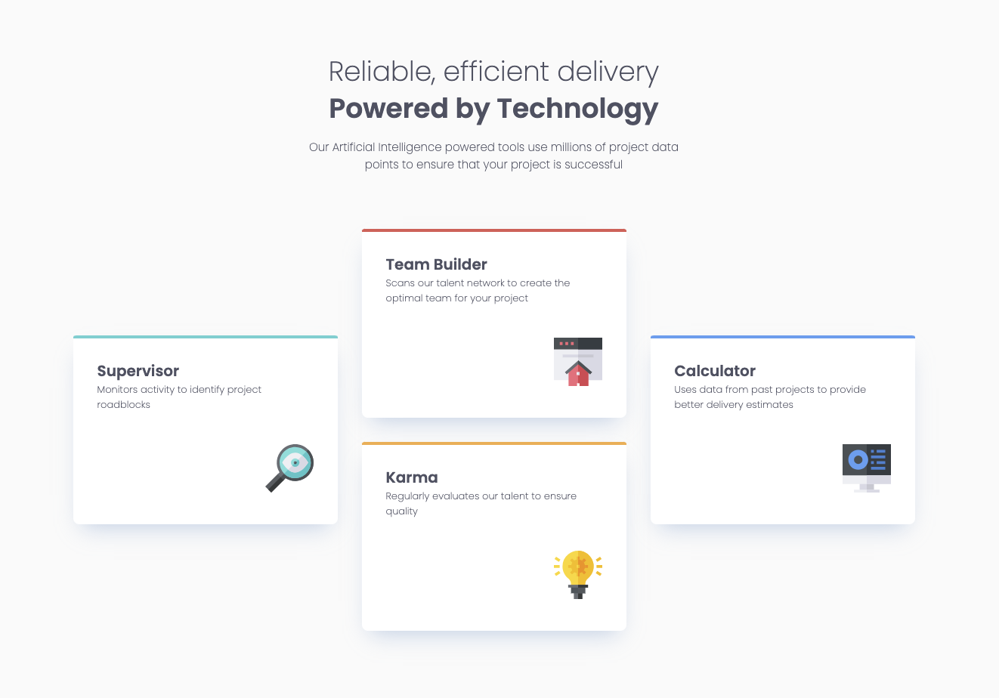

# Frontend Mentor - Four card feature section solution

This is a solution to the [Four card feature section challenge on Frontend Mentor](https://www.frontendmentor.io/learning-paths/building-responsive-layouts--z1qCXVqkD/steps/68319a9a9b5ac95dc59ffd61/challenge/start). Frontend Mentor challenges help you improve your coding skills by building realistic projects.

## Table of contents

- [Overview](#overview)
  - [Screenshot](#screenshot)
  - [Links](#links)
- [My process](#my-process)
  - [Built with](#built-with)
- [Author](#author)

### Screenshot

### Links

- Solution URL: [Add solution URL here](https://github.com/TomDoneix/four-card-feature-section)
- Live Site URL: [live site URL here](https://four-card-feature-section-three-sepia.vercel.app/)

## My process

### Built with

- Semantic HTML5 markup
- CSS custom properties
- Grid
- Tailwind
- Vite

## Author

- Frontend Mentor - [@tomdoneix](https://www.frontendmentor.io/profile/TomDoneix)
